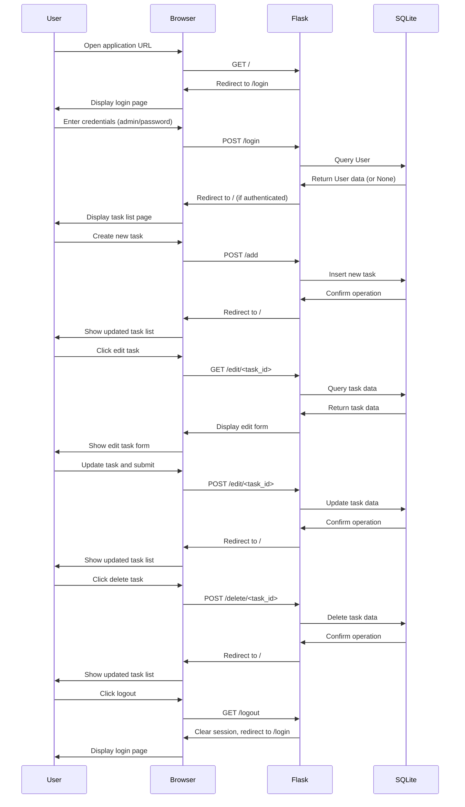

# Flask Task Manager

A simple Flask-based task management application with authentication and CRUD operations for tasks using SQLite database.

## Features

- User authentication with fixed credentials
- Task listing (user-specific)
- Task creation
- Task editing
- Task deletion
- Responsive design

## Prerequisites

- Python 3.8+
- SQLite3

## Installation

1. Clone the repository:
   ```bash
   git clone https://github.com/yourusername/flask-todo-example.git
   cd flask-todo-example
   ```

2. Install the required dependencies:
   ```bash
   pip install -r requirements.txt
   ```

3. Run the application:
   ```bash
   python app.py
   ```

4. Access the application in your web browser:
   ```
   http://127.0.0.1:5001
   ```

5. Login with the following credentials:
   - Username: `admin`
   - Password: `password`

## Project Structure

```
flask-todo-example/
├── app.py                  # Main application file with routes and models
├── instance/
│   └── db.sqlite           # SQLite database file
├── requirements.txt        # Python dependencies
├── README.md               # Project documentation
├── static/
│   └── style.css           # CSS styles
└── templates/
    ├── edit.html           # Task editing template
    ├── index.html          # Task listing template
    └── login.html          # Login template
```

## Technologies Used

- **Flask**: Web framework
- **Flask-SQLAlchemy**: ORM for database operations
- **SQLite**: Database
- **HTML/CSS**: Frontend

## Required Python Libraries

- Flask==2.3.3
- Flask-SQLAlchemy==3.1.1
- SQLAlchemy==2.0.44
- Werkzeug==3.1.3
- Jinja2==3.1.6
- itsdangerous==2.2.0
- click==8.2.1
- blinker==1.9.0
- greenlet==3.2.4
- MarkupSafe==3.0.2
- typing-extensions==4.15.0

## Authentication System

The application uses a fixed authentication system:
- Username: `admin`
- Password: `password`

These credentials are hardcoded in the application for simplicity.

## Database Schema

### User Model
- `id`: Integer, Primary Key
- `username`: String, Unique
- `password`: String

### Todo Model
- `id`: Integer, Primary Key
- `title`: String
- `user_id`: Foreign Key to User model

## Application Flow



## Security Considerations

This application is for educational purposes only and has several security limitations:

1. Fixed credentials are stored in plain text
2. No password hashing
3. No CSRF protection
4. No rate limiting

For production use, implement proper security measures like:
- Password hashing
- CSRF protection
- Secure session management
- Input validation
- Rate limiting

## License

[MIT License](LICENSE)

## 元の解説記事 (Qiita)
サークルの新入生Web研修
https://qiita.com/mmnn/items/70713095e29e1a4b0769
# flask-todo-example
